# Cadius Forums

The Cadius Forum is a site where gamers come together and engage in conversation. The site contains topics and unique posts from it's users.

To visit the live version of the site (hosted by Heroku) click [here](https://cadiusforum.herokuapp.com/)

## Project Board

During this project I have been using the project section of Github to manage and track my User Stories progression.

To view the Project Kanban board click [here](https://github.com/robcole-dev/cadius-forum/projects/1)


## User Stories
- As a User I can Create new topics so that I can get other peoples help or opinions
- As a User I can edit my own topics or replys so that I can correct mistakes
- As a User I can delete any of my topics so that I can manage my own entries
- As a User I can create replys to topics so that i can be involved in the conversation
- As a Site Admin I can create, edit and delete topics / replys so that I can manage any bad behaviour
- As a User I can view Categories and Topics so that I can select what I want to read
- As a User I can register and account so that I can create Topics / replys

## UX

### Wireframes and Designs

Below are a couple of screenshots of flowcharts created for this project.

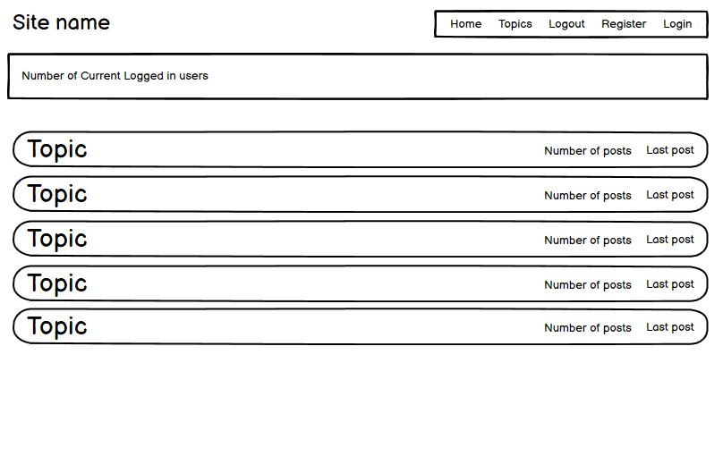

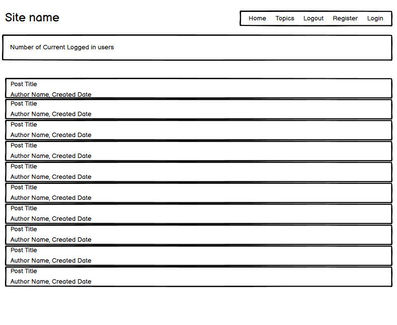

## Features 

Below are a list of key features and future features.

### Existing Features

- __First Load__
    - When the site first loads users are presented with the category screen
    - The user is able to select a category to preview

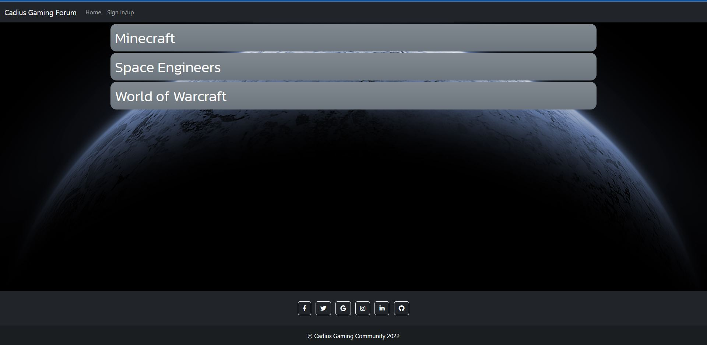

- __Category Detail__
    - When the user clicks on a category to explore they are presented with a list of user created topics
    - The user is able to select a topic to read
    - If the user is registered and logged into the site they are able to create a new topic

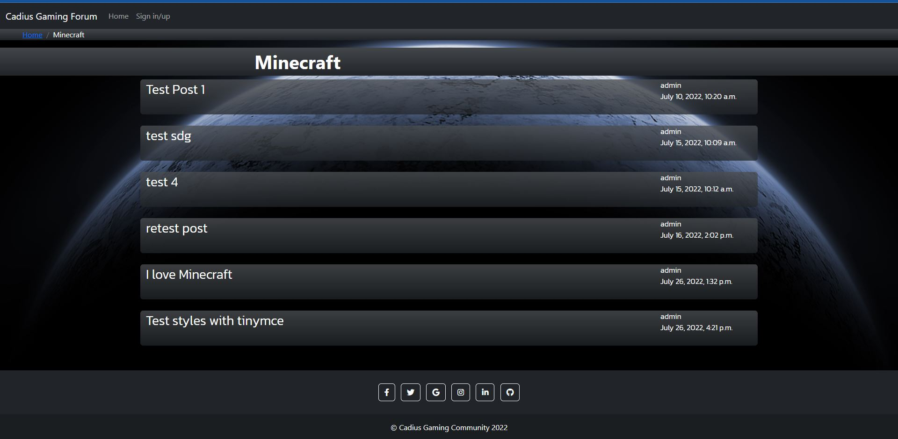
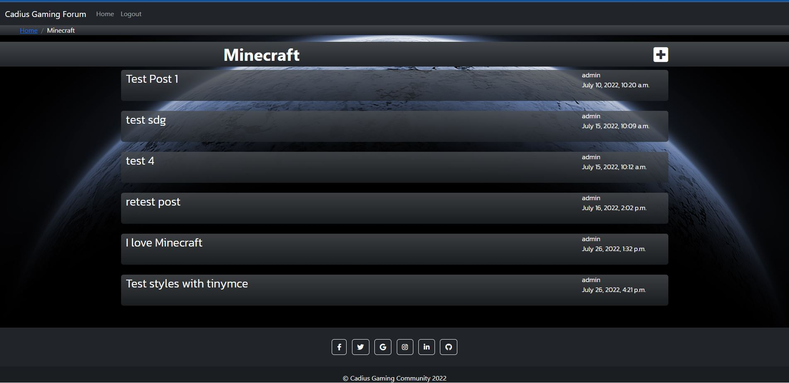

- __Topic Detail__
    - After a user has selected a topic to read they are presented with the topic and all user replies
    - If the user is registed and logged in they are able to reply to the topic
    - If the user is logged in and is the author of the topic they have the ability to edit and delete the topic including the child replies

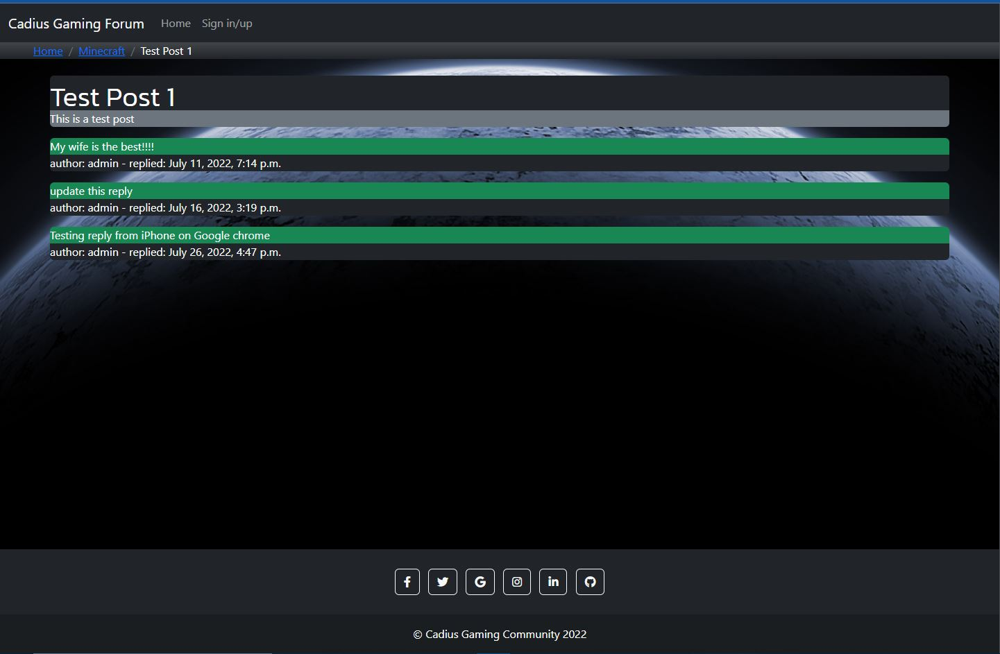
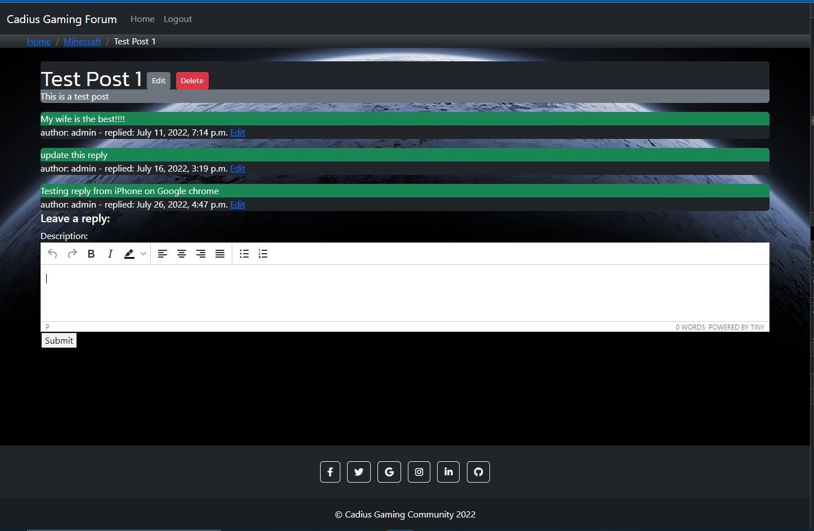

- __Register User__
    - The site offers the ability for users to register on the site

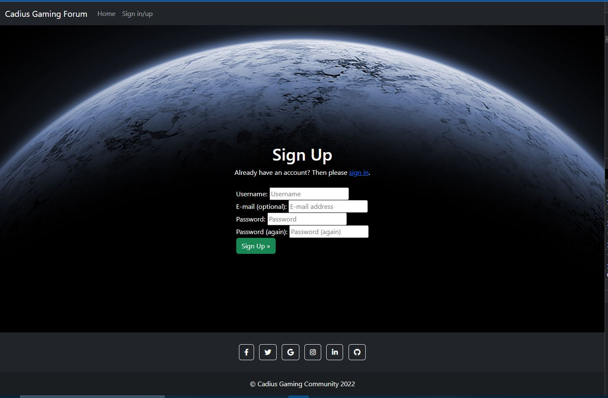

- __Login__
    - Once a user is registered the user is then able to login.

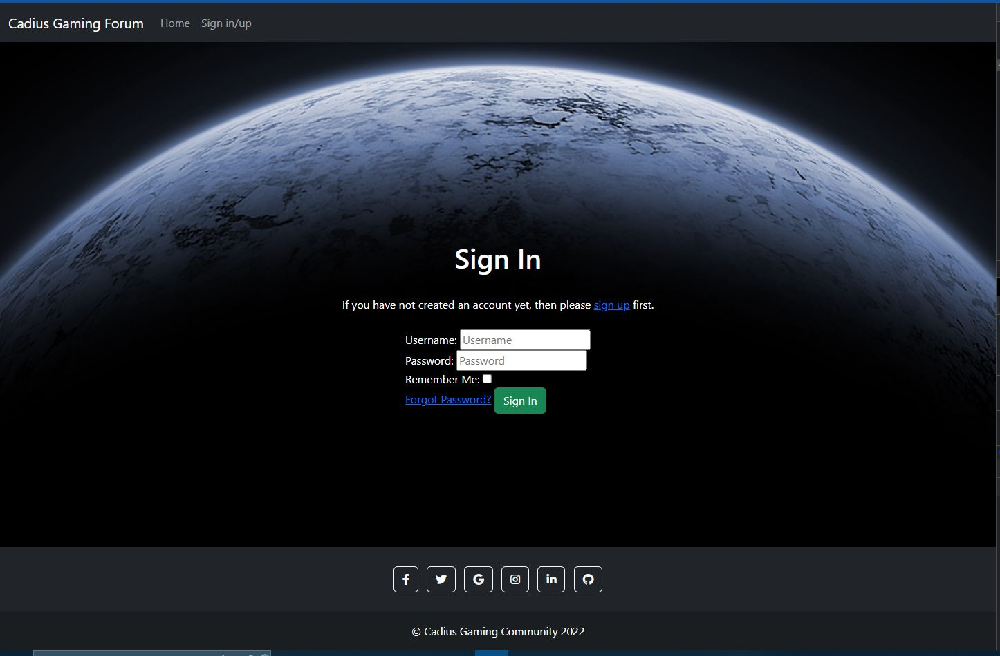

- __Logout__
    - Once the user has finished on the site they are able to log out

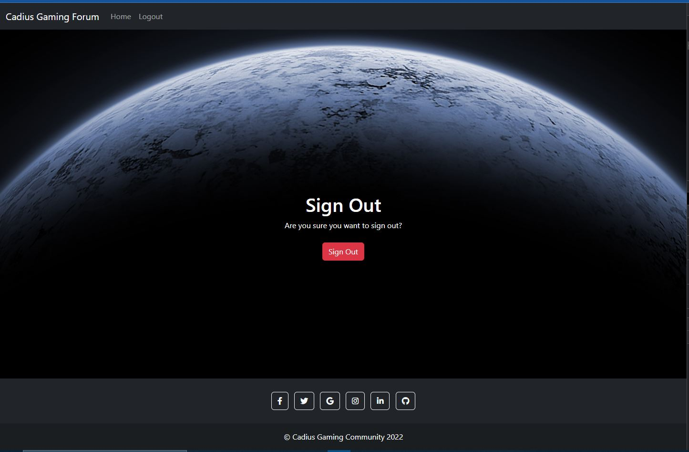

### Features Left to implement

- __Likes__
    - Currently there is no way to leave quick feedback on replies, a like / dislike system will allow users to give this feedback

- __Social Network__
    - Currently the only way to sign up is with an email address. I want to implement the Social network signup that comes with AllAuth


## Technologies Used

During development of the site a number of programs and web based applications were used. You can find a list of the below:

[DrawIO](https://drawio-app.com/) - Used to create the Entity Relationship Diagram

[Balsamiq Wireframse](https://balsamiq.com/wireframes/) - Used to create wireframes of site

[Github](https://github.com/) - Used to host the project

[Gitpod](https://www.gitpod.io/) - Used as a cloud based IDE to code the project

[GIT](https://en.wikipedia.org/wiki/Git) - Used for version control

[Heroku](https://www.heroku.com/) - Used to host the deployed site

Plugins that was used to develop this site are:

[Bootstrap](https://getbootstrap.com/)

[Django](https://www.djangoproject.com/)

[TinyMCE](https://www.tiny.cloud/)

[Django-AllAuth](https://django-allauth.readthedocs.io/en/latest/overview.html)

Code that was used to develop this site are:

[Python](https://www.python.org/)

[HTML5](https://en.wikipedia.org/wiki/HTML5)

[CSS3](https://en.wikipedia.org/wiki/CSS)

## Data Model

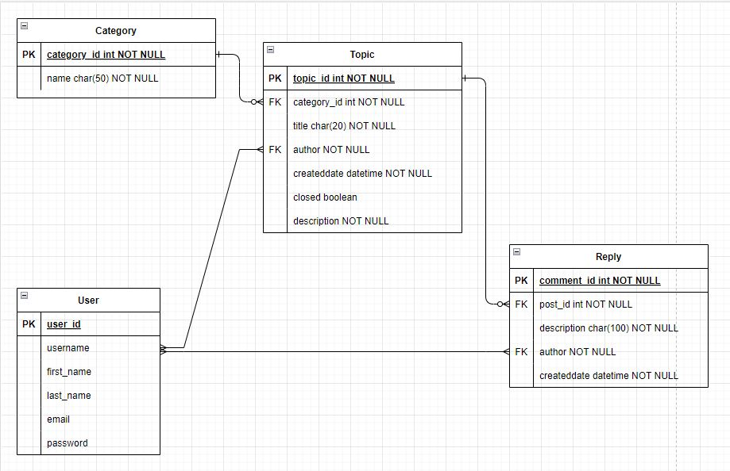

- The first model is Topics. This acts like a folder of posts relating to that topic. The only fields required are ID and title.
- The second model is Posts. This is user created which then allows other users to comment on. This is link to the Topics model via the topics_id key.
- The third model is Comments. This is for when users comment on a post. This is linked to the Posts model via the post_id key.

## Testing

For all testing, please refer to the [TESTING.md](TESTING.md) file.

## Deployment

The site was deployed to Heroku. The steps to deploy are as follows: 
- We need to install everything in the requirements.txt file. To do this we run the following command 
 
    ```pip3 install -r requirements.txt```
- Login / signup to [Heroku](https://id.heroku.com/login)
- On the dasboard, once logged in, click New and then click Create new app
- Give the App a name and select your region, then click create app
- Click resources and in the add-ons search for `Heroku Postgres`. Select the free version and click submit order form.
- Login / signup tp [Cloudinary](https://cloudinary.com/)
- On the dashbpard, once logged in, click the API Environment Variable to copy it
- Navigate back to Heroku and the app you created earlier
- Click settings and then click Reveal config Vars. This is where we need to set a couple of things.
- In the Key box enter `CLOUDINARY_URL` and in the value enter the API Environment Variable you copied earlier. Before clicking add, remove `CLOUDINARY_URL=` from the value field
- In the Key box enter `PORT` and in the value enter `8000` then click add
- In the Key box enter `SECRET_KEY` and in the value enter a random key then click add
- Click deploy from the menu at the top, then click github.
- enter the repositry name and click search. if found the repositry will appear below, click connect.

[Link to deployed site](https://cadiusforum.herokuapp.com/)

### Local Deployment

if you would like to make a clone of this repository, you can type the following command in your iDE terminal:

- `git clone `

Alternatively, if using Git pod, you can click below to create your own workspace using this repository.

[]()

Please make sure to install the requirements using ```pip3 install -r requirements.txt``` in your terminal

## Credits 

### Content

- The icons in the footer were taken from [Font Awesome](https://fontawesome.com/)

### Acknowledgments

- Tim (My Mentor)
- Aura Cole (My Wife)
- The community over on Code Institute's Slack